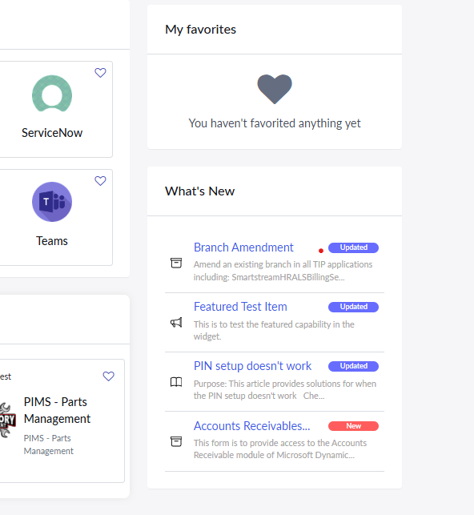

# What's New Widget

## Overview
This is the code for the What's New widget. This is the custom widget I created for the employee center. This widget displays new or updateditems based of records created in a custome table I cerated within a scoped application for this widget. These records can be sheduled to be published and expire at specific dates. These are contorlled by scheduled jobs. These records are approved before they can be published.

## Widget Image

## File Structure
    Whats New Widget/
    ├── Deployment Update Record Scripts/
    │   ├── Client Scripts/
    │   │   ├── populate_description_catalogue.js
    │   │   └── populate_description_knowledge.js
    │   ├── Scheduled Jobs/
    │   │   ├── expire_update.js
    │   │   └── publish_update.js
    │   └── Script Includes/
    │       └── get_description.js
    ├── Widget Code/
    │   ├── client_script.js
    │   ├── css.css
    │   ├── script.js
    │   └── template.html
    ├── ReadMe.md
    └── widget.png

## Languages Used
<ul>
    <li>HTML</li>
    <li>CSS</li>
    <li>JavasScript</li>
    <li>AngularJS</li>
</ul>

